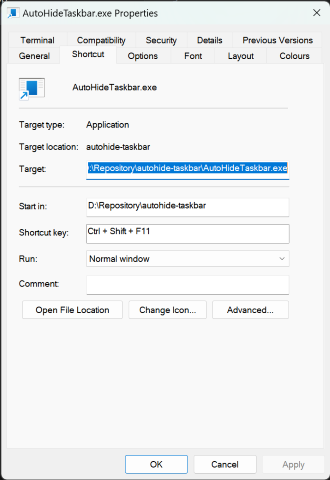

# ToggleTaskbarAutohide
Simple Win32 executable to toggle autohide feature of Windows taskbar. No need to restart the explorer, all the magic is handled by Win32. 

Produced executable can be e.g. called by Autohotkey script to toggle Windows taskbar autohide anytime.

## Example usage

Take built binary `AutoHideTaskbar.exe` and place it to some persistent location. 

### Desktop shortcut

Create a desktop shortcut to `AutoHideTaskbar.exe` binary. Optionally pin the shortcut to you taskbar or start menu. Now whenever you execute the shortcut, you toggle autohide feature of the taskbar.

### Keyboard shortcut

The simplest solution is to rightclick the shortcut, go to Properties (Show more options > Properties) and there setup a global keyboard shortcut.

